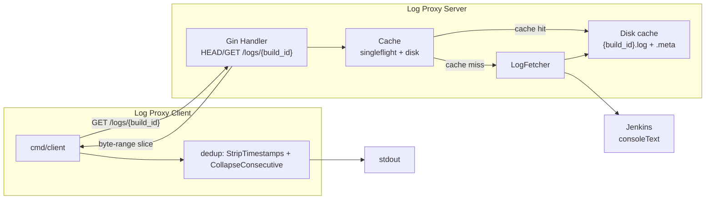

# Log Proxy

A caching proxy and CLI client for Jenkins build console logs.

The proxy fetches a build's console log from Jenkins once, caches it on disk, and serves byte-range slices of it. The client fetches from the proxy and deduplicates the log for fast human review.

## Architecture

The client talks only to the proxy; the proxy fetches from Jenkins on cache miss, stores logs on disk, and serves byte-range slices. Deduplication runs client-side after the full log is fetched.



## Components

| Component | Path | What it does |
|---|---|---|
| **Log Proxy** | `cmd/server` | Gin HTTP server on `:8080`. Proxies and caches raw Jenkins console logs. |
| **Log Proxy Client** | `cmd/client` | CLI that fetches a log from the proxy and deduplicates it for human review. |

## Endpoints

### `HEAD /logs/{build_id}`
Downloads and caches the build's log if not already cached, then returns `Content-Length` / `Content-Type` with no body.

### `GET /logs/{build_id}`
Optional query params:
- `offset` (default `0`) — byte offset to start from
- `limit` (default: remainder of file) — max bytes to return. An explicit `limit=0` returns zero bytes; omitting `limit` returns everything from `offset` onward.

Returns the requested byte slice, with `Content-Length` set to the actual number of bytes returned and `Content-Type` matching the cached source.

### Error responses

| Condition | Status |
|---|---|
| Invalid/unsafe `build_id` | `400` |
| Negative or non-integer `offset`/`limit` | `400` |
| `offset` beyond end of file | `416` |
| Jenkins returns 404 for the build | `404` |
| Jenkins unreachable / non-200 response | `502` |

## Running it

```bash
make build
make run-server           # proxies real ci.jenkins.io
make run-server-fixture   # serves testdata/sample_consoletext.log instead — see note below
make run-client BUILD=lastSuccessfulBuild
make test
```

## Quick verification

```bash
make run-server-fixture &

curl -I http://localhost:8080/logs/lastSuccessfulBuild                  # 200, Content-Length set
curl -s http://localhost:8080/logs/lastSuccessfulBuild                  # full log body
curl -i "http://localhost:8080/logs/lastSuccessfulBuild?offset=999999"  # 416
curl -i "http://localhost:8080/logs/build.1"                            # 400, invalid build_id
```

See [`docs/manual-testing.md`](docs/manual-testing.md) for the full set of manually-verified request/response cases, including offset/limit slicing, concurrent-request caching behavior, and the complete error-status matrix.


## Project structure

```
log-proxy/
├── cmd/
│   ├── server/         # server entrypoint, flag parsing, fixture mode
│   └── client/         # client entrypoint, flag parsing
├── internal/
│   ├── proxy/          # LogFetcher interface, Cache, Gin handlers + tests
│   └── dedup/          # timestamp stripping, consecutive-line collapsing + tests
├── client/             # HTTP fetch + line scanning used by cmd/client
├── testdata/           # sample_consoletext.log — fixture for local testing
├── docs/
│   └── manual-testing.md
├── Makefile
├── REFLECTION.md
└── README.md
```

## Testing

```bash
make test          # go test ./... -v
go test ./... -race  # concurrency-sensitive tests (singleflight) should be run with -race
```
